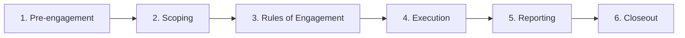

# Week 2: Ethical and Legal Issues in Ethical Hacking

## Overview
This is the only week in the course with no hands-on Docker lab, and that is
deliberate: before you ever run a scanner against a target, you must understand
the law and the professional ethics that make the difference between an
authorized security assessment and a federal crime. This week you will study the
legal framework that governs computer access (primarily the U.S. Computer Fraud
and Abuse Act), the standard engagement lifecycle used by professional
penetration testers, and the professional codes of ethics you are expected to
uphold. Plan on roughly 60–90 minutes of reading and discussion.

## Learning Objectives
- Explain, at a conceptual level, what the U.S. Computer Fraud and Abuse Act
  (CFAA) prohibits and why "authorization" is the single most important word in
  ethical hacking.
- State the one rule that has no exceptions: **never test a system you do not
  own without written permission**, and recognize the legal and career
  consequences of breaking it.
- Describe the six phases of a professional engagement lifecycle
  (pre-engagement → scoping → rules of engagement → execution → reporting →
  closeout) and what is produced or agreed at each phase.
- Compare the professional codes of ethics published by EC-Council, (ISC)², and
  OWASP, and identify the duties they share.
- Draft a basic Rules of Engagement document and reason through realistic
  legal/ethical scenarios using the materials in the discussion guide.

## Setup
This week requires **no Docker** and no software installation. To complete it:

1. Read this README end to end (~30 min).
2. Open `discussion-guide.md` and work through it on your own or in a small
   group (~45 min): discuss the case studies, complete the rules-of-engagement
   activity, answer the quiz, and reflect on the "What would you do?" dilemma.
3. Open `rules-of-engagement-template.md` and fill it in for the fictional
   company described in the discussion guide (~15 min).

That is it — pen, paper, and honest conversation are the only tools you need.

## The Legal Framework: The Computer Fraud and Abuse Act

In the United States, the single most important law for an ethical hacker to
understand is the **Computer Fraud and Abuse Act (CFAA)**, codified at
18 U.S.C. § 1030. Passed in 1986 and amended several times since, it is the
federal statute most often used to prosecute unauthorized computer access. Other
countries have close analogues — the UK **Computer Misuse Act 1990**, the
Australian **Criminal Code Act** computer offences, and the EU's **Directive
2013/40/EU** — and they share the CFAA's central idea. Learn that idea, and the
local statutes are variations on a theme.

### The one word that matters: authorization

The CFAA makes it a crime to *intentionally* access a "protected computer"
**without authorization**, or to **exceed authorized access**. Almost every
prosecution turns on one of those two phrases. Read them again, slowly:

- **Without authorization** means you had no right to access the system at all.
  You guessed a URL, ran a scanner against an IP you don't own, or used stolen
  credentials. You were never invited in.
- **Exceeding authorized access** means you *did* have a legitimate account or
  permission, but you used it to reach data or systems you were not entitled
  to. An employee who logs in to a payroll system to snoop on colleagues'
  salaries "exceeds authorized access."

> **The rule (no exceptions): never test a system you do not own without
> written permission.** Written permission — usually called an *authorization
> letter* or, informally, a "get-out-of-jail-free" letter — is what converts an
> act that would otherwise be a crime into a legitimate security assessment. It
> names the target, the techniques permitted, the people authorized, and the
> time window. If any of those are missing or unclear, you do not have
> authorization; you have a risk.

### What counts as a "protected computer"?

The CFAA's definition of a **protected computer** is deliberately broad: it
covers any computer "used in or affecting interstate or foreign commerce or
communication." Because almost every modern computer is internet-connected, and
the internet is interstate commerce, *essentially every computer you are likely
to encounter is a protected computer*. Do not comfort yourself with "this
server is just a small business in one state" — it is still protected.

### Intent matters, motive does not

The CFAA requires *intentional* access, but it largely does **not** care about
your motive. "I was just curious," "I was trying to help them," and "I only
looked, I didn't change anything" are **not defenses**. A well-meaning
researcher who pokes at a hospital portal to "prove" it is insecure has still
accessed a protected computer without authorization. This is why responsible
disclosure programs, coordinated vulnerability disclosure (CVD) policies, and
bug-bounty platforms exist: they create a *legal* path for good-faith research
by granting authorization up front.

### Consequences

Unauthorized access under the CFAA can carry:

- **Criminal penalties**: a first-time, low-damage offence can be a misdemeanour
  (up to one year); offences involving damage, repeat offending, or certain
  motives can be felonies carrying years in prison.
- **Civil liability**: a victim who suffers "loss" (defined to include response
  costs, damage assessment, and restoration) can sue for damages and injunctions.
- **Career and professional consequences**: loss of industry certifications
  (CISSP, CEH, OSCP, etc.), termination, and a permanent record that closes most
  security jobs forever. A CFAA conviction can also bar you from many jobs that
  require security clearance.

> **Note on *Van Buren v. United States* (2021).** The U.S. Supreme Court
> narrowed "exceeds authorized access": it cannot be triggered merely because
> someone broke a written use policy or terms of service. To "exceed
> authorization" you must access a *specific area or data* of a computer that
> you had no right to reach. This is a meaningful limit on the CFAA, but it
> does **not** legalize scanning or logging in to systems you were never
> invited to use — "without authorization" still covers those.

## The Engagement Lifecycle

Professional penetration testing follows a standard six-phase lifecycle. The
phases exist so that nothing technical happens until the legal and ethical
groundwork is laid. Memorize the order — every later lab in this course sits
inside **phase 4, execution**, and assumes phases 1–3 are already done.

### 1. Pre-engagement
Initial contact, goal-setting, and contracting. The client explains what they
want (e.g., "are we exposed before the holiday launch?"). Both sides sign a
**non-disclosure agreement (NDA)** and a **master services agreement (MSA)**,
and agree on the test type:
- **Black-box** — tester knows only the target's name, mimics an outsider.
- **Grey-box** — tester is given some information (e.g., a low-privilege
  account) to model an insider or a compromised user.
- **White-box** — tester is given full access to source code, architecture, and
  credentials.
*Artefact:* signed NDA + MSA. *Decision locked in:* the engagement's overall
goal and test type.

### 2. Scoping
The most important non-technical phase. Tester and client agree on exactly
**which assets, IP ranges, applications, and services** are in scope, which are
out of scope, and **when** testing may occur. This is where you write down
"`www.acme-logistics.example` is in scope; the third-party payment provider is
not." Vague scope produces vague (and legally risky) testing.
*Artefact:* the asset / scope list. *Decision locked in:* the precise target
inventory and testing windows. Week 3 of this course is essentially a deep dive
into scoping using captured traffic.

### 3. Rules of Engagement (RoE)
The RoE specifies *how* the in-scope targets may be tested: which techniques
are permitted (scanning, exploitation, credential attacks), which are
prohibited (denial of service, social engineering of real staff, touching
third parties), the communication and reporting cadence, emergency contacts,
and data-handling rules. It is signed by both parties. **No testing should
begin until the RoE is signed.** See `rules-of-engagement-template.md` for the
format you will complete this week.
*Artefact:* the signed Rules of Engagement. *Decision locked in:* the
permitted/prohibited technique matrix and escalation procedures.

### 4. Execution
The actual testing: reconnaissance, scanning, vulnerability identification,
exploitation, and post-exploitation — always within the signed scope and RoE.
Everything you do is logged, timestamped, and evidence-grade, because the
report depends on it and the log is your proof you stayed in scope.
*Artefact:* the findings/evidence log. *Decision locked in:* what was actually
tested and what was found.

### 5. Reporting
Findings are written up with severity ratings (commonly CVSS v3.1), clear
reproduction steps, business-impact statements, and remediation
recommendations. The client reviews a draft, you correct errors, and a final
report is delivered. A good report is what the client pays for; the hacking is
just how the data is gathered.
*Artefact:* the final penetration-test report. *Decision locked in:* the
severity ratings and the remediation roadmap.

### 6. Closeout
Optional re-testing of fixes, **secure deletion of all client data**, return or
destruction of credentials, and a lessons-learned debrief. Closeout is where
you prove you are trustworthy enough to be hired again: you leave nothing
behind.
*Artefact:* a closeout / deletion-confirmation memo. *Decision locked in:* that
the engagement is formally ended and client data is handled.

## Professional Codes of Ethics

A professional code of ethics is a published set of duties that members of a
certifying body agree to uphold. Three matter most in ethical hacking.

### EC-Council (CEH — Certified Ethical Hacker)
EC-Council's code is built around the idea that the "ethical" in ethical
hacking is a real constraint, not a marketing label. Its core tenets require
members to: keep information and knowledge gained during work confidential;
perform duties only within the scope of authorization; **not** use their skills
illegally or maliciously; disclose any conflict of interest; maintain and
advance their technical competence; and conduct themselves professionally. The
emphasis is on *staying inside the lines you were hired to operate within*.

### (ISC)² (CISSP, etc.)
The (ISC)² code is famous for being **short and ordered**. Its four canons are
listed in descending priority, meaning if two duties ever conflict, the higher
one wins:

1. **Protect society, the common good, necessary public trust and confidence,
   and the infrastructure.**
2. **Act honorably, honestly, justly, responsibly, and legally.**
3. **Provide diligent and competent service to principals.**
4. **Advance and protect the profession.**

Notice that duty to society ranks *above* duty to the client ("principals").
This ordering is deliberate and uncomfortable: it means there are situations
where the ethically correct action is to act against your client's immediate
wishes because the public interest is greater.

### OWASP
OWASP is not a certifying body in the same way, but its **Core Values** and the
ethical guidelines in the *OWASP Testing Guide* shape how application security
is practised worldwide. OWASP commits to being free, open, and vendor-neutral,
and expects contributors and testers to operate with transparency, to practise
**responsible/coordinated disclosure** of vulnerabilities, and to remember that
"with great knowledge comes great responsibility." Its stance is that security
knowledge should spread so defenders get stronger — but never to enable
malicious use.

### What they share

Despite different wording, all three codes converge on the same duties:

- **Authorization and scope.** Only test what you are explicitly permitted to
  test, within the agreed window.
- **Confidentiality.** Client data and findings stay private and are destroyed
  at closeout.
- **Honesty and legality.** No deception of the client, no illegal acts, full
  and truthful reporting.
- **Public protection.** When public safety is at stake, it outranks the
  client's preference for secrecy.
- **Competence.** Only take on work you are qualified to do; keep learning.
- **Responsible disclosure.** Report vulnerabilities to the people who can fix
  them before (or instead of) publicising them.

These are not optional courtesies. A certified professional who breaks them can
lose their certification, and the codes are frequently cited in court and in
hiring decisions as the standard a "reasonable" security professional is
expected to meet.

## Activities

### Activity 1 — The legal framework: the CFAA and authorization (25 min)
Read the "Legal framework" section above. As you read, write down the answers to
these questions (the discussion guide asks them again as a short quiz):

- What single word does the CFAA turn on, and why does it matter?
- What counts as a "protected computer" under the CFAA? (Hint: almost anything
  connected to the internet.)
- What is the difference between *having no permission* and *exceeding*
  permission you were granted?
- Name two real-world consequences of unauthorized access (criminal, civil, or
  career).

Discuss: *Why does "I was just curious" or "I was trying to help" not protect
someone under the CFAA?*

### Activity 2 — The engagement lifecycle (20 min)
Read the "Engagement lifecycle" section above. Working in pairs, draw the six
phases as a flowchart and label each phase with: (a) the main artefact produced
and (b) one decision that gets locked in at that phase. For example, in
**scoping** the main artefact is the asset list and one decision is "is
`mail.example.com` in scope?".

Cross-check your flowchart against week 3's traffic-analysis lab, which feeds
the *scoping* and *proposal* phases you are about to study.

### Activity 3 — Professional codes of ethics (15 min)
Read the "Professional codes of ethics" section. In the discussion guide you
will be asked to pick the one canon (from EC-Council, (ISC)², or OWASP) you
think matters most and defend it. Decide now which duty — to *society*, to the
*client*, to the *profession*, or to the *public* — you would rank first, and
why.

### Activity 4 — Discussion guide and RoE template (30 min)
Complete `discussion-guide.md` (case studies, RoE activity, dilemma, quiz) and
fill in `rules-of-engagement-template.md` for the fictional company
"Acme Logistics." Bring both to the next class — they form the basis of the
week 3 proposal-writing exercise.

## Cleanup
There is nothing to tear down this week — no containers, no networks. Save your
completed discussion guide and Rules of Engagement document; you will reuse the
RoE format for the written authorization step of every later lab.

**Ethics**: This entire week *is* the ethics lesson. The one rule to carry into
every following week: no system is tested without explicit, written
authorization that names the target, the techniques allowed, and the window of
time. When in doubt, do not run the command.

Generated with Claude Code.
