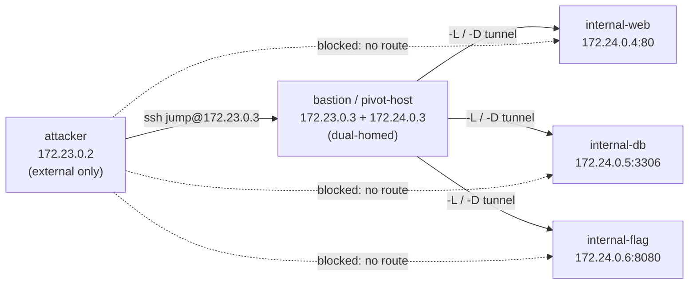

# Week 9: Lateral Movement & Pivoting Lab

## Overview
After a foothold is gained on one host, real attackers rarely stop there: they **pivot**
through that beachhead to reach systems that are not directly routable from their own
machine. This lab builds a two‑segment network in isolated Docker and teaches you to use
OpenSSH port forwarding (`-L`/`-R`/`-D`) and `proxychains` to tunnel through a bastion host,
plus how Metasploit's `autoroute`/`route` accomplish the same thing post‑exploitation.

> **Honest note on the targets.** A genuine pivoting engagement usually routes through a
> compromised Windows box into an Active Directory forest. Running licensed Windows images in
> a lab is impractical, so the internal "hosts" here are **Linux stand‑ins** for a corporate
> network — an intranet web server, a MySQL database, and a flag service. The *networking and
> pivoting skills are identical*; only the OS of the boxes differs. Everything runs offline in
> isolated Docker with no external egress and no real credentials.

## Topology
Two isolated bridges. The attacker sits on the **external** segment only. The bastion
(`pivot-host`) is the one host joined to **both** segments, which is what makes it a viable
pivot. The three `internal-*` hosts live on the **internal** segment and are unreachable from
the attacker without a tunnel.

```
          EXTERNAL 172.23.0.0/24                  INTERNAL 172.24.0.0/24
  ┌───────────────────────────────┐      ┌───────────────────────────────────┐
  │                               │      │                                   │
  │   attacker 172.23.0.2 ────────┼──────┼─► (NO direct route — must pivot)  │
  │   (Kali, ethical-base)        │      │                                   │
  │          │                    │      │  internal-web   172.24.0.4 :80    │
  │          │ can reach          │      │  internal-db    172.24.0.5 :3306  │
  │          ▼                    │      │  internal-flag  172.24.0.6 :8080  │
  │   pivot-host / bastion        │      │                                   │
  │   172.23.0.3  ◄──dual-homed──►┼──────┼─► 172.24.0.3 (bastion's 2nd NIC) │
  │                               │      │                                   │
  └───────────────────────────────┘      └───────────────────────────────────┘
                  │
                  ▼  host port 23022:22 (only exposed port)
              your laptop
```



| Host | Image | External IP | Internal IP | Notes |
|------|-------|-------------|-------------|-------|
| attacker | `ethical-base` (Kali) | 172.23.0.2 | — | pivoting workstation |
| pivot-host (bastion) | `ubuntu:22.04` | 172.23.0.3 | 172.24.0.3 | ssh `jump:jump3r!`, dual‑homed |
| internal-web | `httpd:2.4` | — | 172.24.0.4 | "INTERNAL CORP PORTAL" |
| internal-db | `mysql:8` | — | 172.24.0.5 | root pw `int3rnal`, bonus flag |
| internal-flag | `alpine` | — | 172.24.0.6 | netcat flag service on :8080 |

## Learning Objectives
- Explain why a dual‑homed bastion is the key to lateral movement.
- Prove (and reason about) network segmentation that blocks direct access.
- Build an SSH **local** forward (`-L`) to reach a single internal port.
- Build an SSH **dynamic SOCKS** forward (`-D`) and route arbitrary tools through it with `proxychains`.
- Retrieve a flag from an internal service through the tunnel.
- Describe how Metasploit's `autoroute` / `route` / SOCKS modules perform the same pivoting.

## Setup (5 min)
1. Build the shared base image (from repo root): `make build-base`
2. Start the lab: `cd labs/week9 && docker compose up -d`
3. Enter the attacker (this is where all pivoting happens):
   ```bash
   docker exec -it week9-attacker bash
   ```
   The bastion's SSH is also reachable from your host at `localhost:23022` (`jump` / `jump3r!`),
   but the exercises below are performed **from inside the attacker container**.

> Credentials used in this lab: bastion SSH `jump` / `jump3r!`, internal‑db root `int3rnal`.
> These are deliberately weak and exist only in this isolated environment.

## Activities

### (a) Prove the internal segment is unreachable directly (5 min)
From inside the attacker container, try to hit the internal hosts. There is **no route**
between the two Docker bridges, so these time out or fail to resolve:
```bash
curl --connect-timeout 5 http://172.24.0.4          # hangs / no route to host
curl --connect-timeout 5 http://internal-web         # name does not resolve here
nmap -sn 172.24.0.0/24                               # nothing answers
```
**Record:** what error each command produces and *why* (the attacker has no interface on
172.24.0.0/24). The only host you can reach is the bastion: `ping -c2 172.23.0.3`.

### (b) SSH local forward — one port at a time (10 min)
`-L local_port:target:host_port` opens a listening port on the attacker and forwards it
through the bastion to the target. The target name/IP is resolved **from the bastion's
network namespace**, which is why it can reach 172.24.0.4.
```bash
# -N : no shell, just the tunnel   -f : go to background
sshpass -p 'jump3r!' ssh -N -f \
  -o StrictHostKeyChecking=no -o UserKnownHostsFile=/dev/null \
  -L 8080:172.24.0.4:80 jump@172.23.0.3

curl http://localhost:8080      # returns the INTERNAL CORP PORTAL
```
Try a hostname target too — it resolves on the bastion side:
```bash
sshpass -p 'jump3r!' ssh -N -f -o StrictHostKeyChecking=no -o UserKnownHostsFile=/dev/null \
  -L 8082:internal-web:80 jump@172.23.0.3
curl http://localhost:8082
```
> Manual (no sshpass) form: `ssh -N -L 8080:172.24.0.4:80 jump@172.23.0.3` and type the
> password when prompted.

### (c) SSH dynamic SOCKS forward + proxychains (15 min)
A local forward maps one port. A **dynamic** forward (`-D`) turns the bastion into a SOCKS5
proxy, so *any* tool can be routed to *any* internal host/port through one tunnel. The
attacker's `proxychains` is preconfigured to use `socks5 127.0.0.1 1080`.
```bash
# Start the SOCKS5 proxy on the attacker's :1080
sshpass -p 'jump3r!' ssh -N -f \
  -o StrictHostKeyChecking=no -o UserKnownHostsFile=/dev/null \
  -D 1080 jump@172.23.0.3

# Route tools through it
proxychains curl http://172.24.0.4                       # the portal (by IP)
proxychains curl http://internal-web                     # resolves on the bastion
proxychains nmap -sT -Pn -p 80,3306,8080 172.24.0.0/24   # scan through the pivot
proxychains mysql -h 172.24.0.5 -u root -pint3rnal -e 'SHOW DATABASES;'
```
**Record:** which internal services `nmap` reports. Notice you never typed an internal
password for SSH — you only authenticated to the bastion.

### (d) Retrieve the flag through the tunnel (5 min)
The `internal-flag` service (172.24.0.6:8080) is a netcat listener that replies with the lab
flag. Grab it two ways:
```bash
# Option 1: a dedicated local forward straight to the flag service
sshpass -p 'jump3r!' ssh -N -f -o StrictHostKeyChecking=no -o UserKnownHostsFile=/dev/null \
  -L 8081:172.24.0.6:8080 jump@172.23.0.3
curl http://localhost:8081

# Option 2: reuse the SOCKS proxy from (c) — no new tunnel needed
proxychains curl http://172.24.0.6:8080
```
**Flag:** `FLAG{lateral_movement_success}` — paste it in your worksheet.
*Bonus:* query `internal-db` through the SOCKS proxy for `SELECT * FROM corpdb.secrets;` to
find `FLAG{deep_dive_db_access}`.

### (e) How Metasploit does the same thing (10 min — concept, no run required)
Metasploit performs pivoting **after** you have a Meterpreter session on the bastion, with no
SSH needed:

1. **`post/multi/manage/autoroute`** — point it at your session and it adds a route so the
   framework (and its modules) can talk to the internal subnet *through* that session:
   ```
   meterpreter> background
   msf6 > use post/multi/manage/autoroute
   msf6 > set SESSION 1
   msf6 > set SUBNET 172.24.0.0
   msf6 > run
   ```
   Equivalent manual command: `route add 172.24.0.0 255.255.255.0 1`.
2. **`auxiliary/server/socks_proxy`** — once the route exists, stand up a SOCKS server inside
   Metasploit and point your *external* `proxychains` at it, exactly like activity (c). Now
   `nmap`, `curl`, `mysql`, and browser tools all flow through the compromised box.
3. **Portfwd / port forward modules** — the Meterpreter equivalent of `ssh -L`, for reaching a
   single internal port.

The mental model is identical to this lab: *gain a foothold on the dual‑homed box → use it as
a relay → reach the unroutable segment behind it.* SSH pivoting (this lab) is the manual
analogue you can run anywhere; `autoroute` is the same idea automated inside a framework
session.

## Cleanup
```bash
docker compose down        # from labs/week9
docker compose down -v     # also drops the mysql data volume
```

**Ethics**: Educational use only in this isolated Docker network. Pivoting, tunneling, and
reconnaissance of any system you do not own or do not have **written authorization** to test
is illegal. Internal networks only — no real credentials, no external targets.

Generated with Claude Code.
